```mermaid
graph TD
    A["Format Specifiers"] --> B["%d<br/>int"]
    A --> C["%f / %.2f<br/>float"]
    A --> D["%lf<br/>double"]
    A --> E["%c<br/>char"]
    A --> F["%s<br/>string"]
    A --> G["%u<br/>unsigned int"]
    A --> H["%ld<br/>long int"]
    A --> I["%lld<br/>long long int"]
    A --> J["%x / %X<br/>hexadecimal"]
    A --> K["%o<br/>octal"]
    A --> L["%%<br/>percent symbol"]

    style A fill:#e1f5fe,stroke:#0277bd,stroke-width:3px,color:#000
    style B fill:#e8f5e9,stroke:#388e3c,stroke-width:2px
    style C fill:#e8f5e9,stroke:#388e3c,stroke-width:2px
    style D fill:#e8f5e9,stroke:#388e3c,stroke-width:2px
    style E fill:#fff3e0,stroke:#ef6c00,stroke-width:2px
    style F fill:#fff3e0,stroke:#ef6c00,stroke-width:2px
    style G fill:#fce4ec,stroke:#d81b60,stroke-width:2px
    style H fill:#fce4ec,stroke:#d81b60,stroke-width:2px
    style I fill:#fce4ec,stroke:#d81b60,stroke-width:2px
    style J fill:#ede7f6,stroke:#5e35b1,stroke-width:2px
    style K fill:#ede7f6,stroke:#5e35b1,stroke-width:2px
    style L fill:#cfd8dc,stroke:#455a64,stroke-width:2px
```

# C-Programming_Docs
# 📘 C Language Format Specifiers (for `printf` and `scanf`)

In C programming, format specifiers are used in functions like `printf()` and `scanf()` to tell the compiler the type of data being handled.

---

## 🧾 Format Specifier Table

| Format Specifier | Data Type           | Example (Print)         | Usage Purpose             |
|------------------|---------------------|--------------------------|---------------------------|
| `%d`             | `int`               | `printf("%d", num);`     | Integer                   |
| `%f`             | `float`             | `printf("%f", pi);`      | Float                     |
| `%.2f`           | `float`             | `printf("%.2f", pi);`    | Float (2 decimal places)  |
| `%lf`            | `double`            | `scanf("%lf", &d);`      | Double input (`%f` in `printf`) |
| `%c`             | `char`              | `printf("%c", ch);`      | Character                 |
| `%s`             | `char[]` (string)   | `printf("%s", str);`     | String                    |
| `%u`             | `unsigned int`      | `printf("%u", num);`     | Unsigned Integer          |
| `%ld`            | `long int`          | `printf("%ld", n);`      | Long Integer              |
| `%lld`           | `long long int`     | `printf("%lld", n);`     | Long Long Integer         |
| `%x` / `%X`      | Hexadecimal         | `printf("%x", num);`     | Hexadecimal format        |
| `%o`             | Octal               | `printf("%o", num);`     | Octal format              |
| `%%`             | Percent Symbol      | `printf("%%");`          | Prints `%`                |

---

## 🔁 Example Code (Print & Input)

```c
#include <stdio.h>

int main() {
    int a = 10;
    float b = 3.14;
    char ch = 'A';
    char str[10] = "Hello";

    // Print
    printf("%d\n", a);
    printf("%f\n", b);
    printf("%c\n", ch);
    printf("%s\n", str);

    // Input
    scanf("%d", &a);
    scanf("%f", &b);
    scanf(" %c", &ch);  // Note: space before %c
    scanf("%s", str);   // No '&' needed for strings

    return 0;
}
```
## 🧾 C Format Specifiers Diagram


